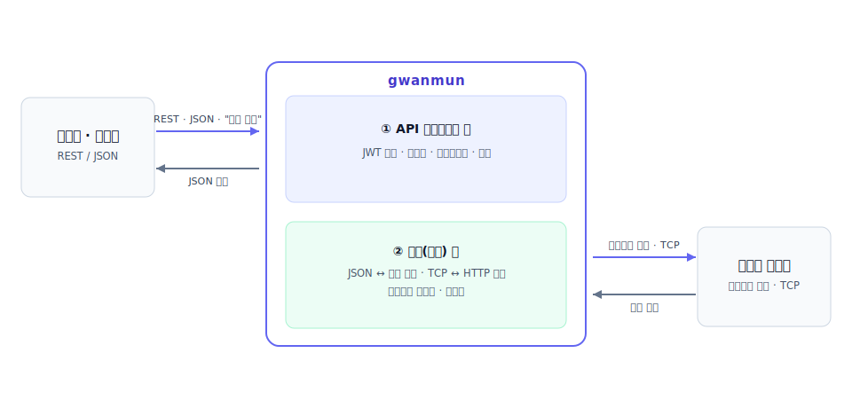
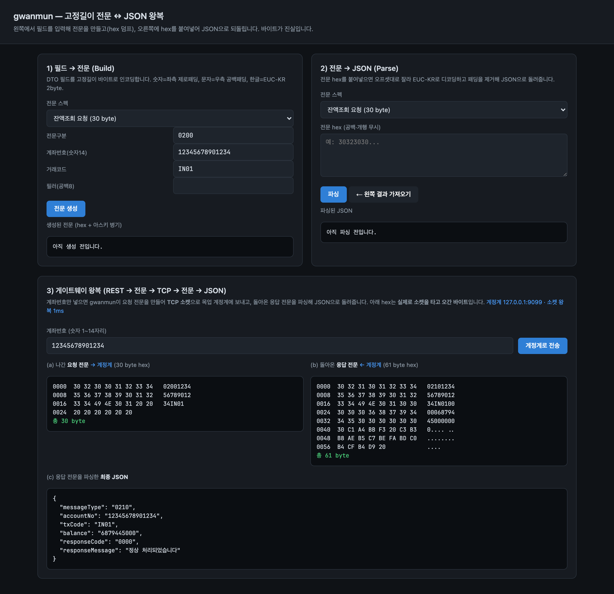
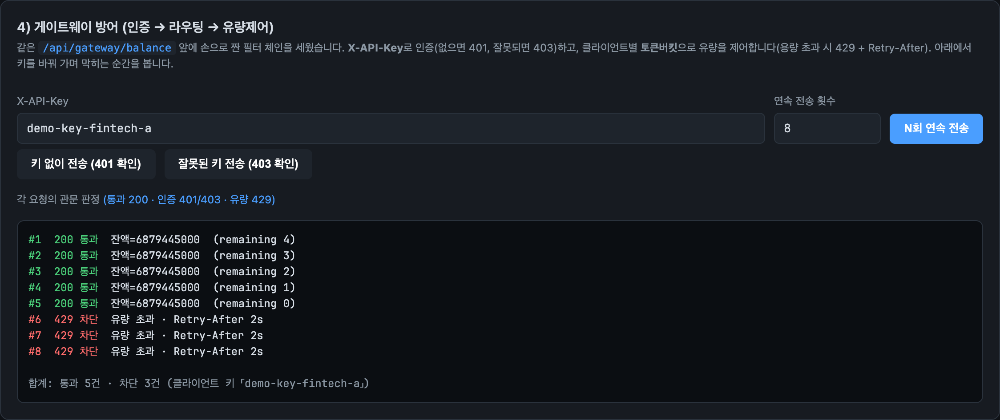
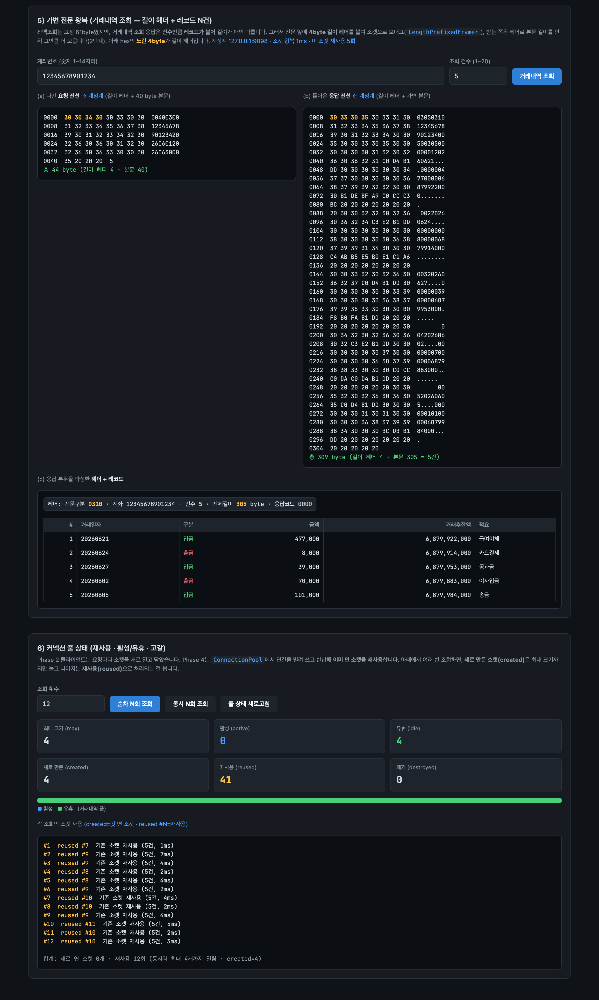
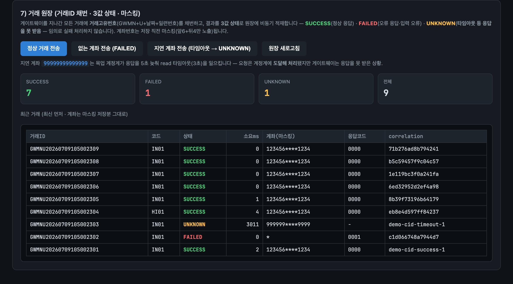

# gwanmun(관문) — 레거시 전문과 현대 REST를 잇는 연계 게이트웨이

> 은행 계정계는 아직도 **고정길이 전문(電文)**과 **TCP 소켓**으로 말하고,
> 모바일·핀테크는 **JSON**과 **HTTP REST**로 말한다. 둘은 직접 대화가 안 되는데,
> 계정계를 통째로 뜯어고치는 건 현실적으로 감당하기 어려운 규모다.
> gwanmun은 그 사이에 서서 **①관문(인증·라우팅·유량제어)**과
> **②연계 통역(전문↔JSON, TCP↔HTTP 변환)**을 한 흐름으로 처리한다.

## 두 층 구조

외부(모바일·핀테크)의 REST/JSON 요청을 앞단 게이트웨이가 인증·라우팅·유량제어로 받고,
그 아래 연계층이 레거시 계정계가 알아듣는 고정길이 전문으로 통역해 TCP로 주고받는다.

- **① API 게이트웨이 층** — 필터 체인으로 인증·라우팅·유량제어를 직접 구현한다(프레임워크 통짜 대신 손으로).
- **② 연계(통역) 층** — 고정길이/가변길이 전문 ↔ JSON 매핑, TCP ↔ HTTP 변환, 거래코드 라우팅.

## 데모 (실측 화면)

REST 요청이 전문으로 바뀌어 TCP로 계정계를 다녀오는 왕복 — 나간 요청 전문 hex, 돌아온 응답 전문
hex(EUC-KR 한글 포함), 최종 JSON까지. 아래 hex는 실제로 소켓을 타고 오간 바이트다.

필터 체인 방어 — 미인증 401 / 잘못된 키 403 / 연속 전송 시 토큰버킷 초과 429:

가변길이 전문(4byte 길이 헤더 + 레코드 N건)과 커넥션 풀 재사용:

거래 원장 — 모든 거래에 거래고유번호를 채번하고 3값 상태(SUCCESS/FAILED/**UNKNOWN**)로 적재.
타임아웃은 실패가 아니라 미확인이다(임의로 실패 처리하지 않는다). 계좌는 마스킹 저장:

## 스택

| 층 | 도구 |
|---|---|
| 게이트웨이 | Spring Boot 3.3.5 (MVC) + 자체 필터 체인(인증·라우팅·유량제어) |
| 연계 통역 | Java 21 — 전문 스펙(어노테이션) ↔ byte[] ↔ DTO ↔ JSON 코덱 |
| 통신 | java.net 소켓(TCP) — 고정길이·길이 프리픽스 프레이밍, partial read 재조립, 커넥션 풀 |
| 레거시 목업 | 전문을 주고받는 작은 TCP 서버(잔액조회·거래내역) |
| 관측 | 거래 원장(거래ID 채번·3값 상태·비동기 적재 — H2/PostgreSQL) + actuator·Prometheus 커스텀 메트릭 + correlation ID(MDC) |
| 구조 | Spring Modulith — message·core·gateway·ledger·web 모듈 경계를 코드가 강제(ApplicationModules.verify) |

## 원칙

1. **상황에서 출발** — 두 시스템이 말이 안 통하는 문제에서, 필요한 것부터 만든다.
2. **실측 필수** — 전문 hex 덤프까지 포함한 e2e 스크린샷 + [docs/VERIFICATION.md](docs/VERIFICATION.md).
3. **못 하는 것 표기** — 금융결제원 표준 전문 전수가 아니라 대표 거래 몇 종. "표준 전수 아님"을 정직히.

## 진행

- **Phase 1** — 고정길이 전문 파서/빌더(EUC-KR, 패딩, 길이 검증) + 데모 화면
- **Phase 2** — TCP 프레이밍(partial read 재조립) + 목업 계정계 + 게이트웨이 왕복(REST→전문→TCP→JSON)
- **Phase 3** — 필터 체인(인증·라우팅·유량제어) + Spring Modulith 모듈러 모놀리스
- **Phase 4** — 가변길이 전문(길이 프리픽스 프레이밍) + 커넥션 풀
- **Phase 5** — 관측 가능한 거래 원장(거래ID 채번, 3값 상태 SUCCESS/FAILED/UNKNOWN, 비동기 적재, 계좌 마스킹) + correlation ID·Prometheus 메트릭·헬스 프로브

각 단계의 함정·판단·검증은 [docs/ROADMAP.md](docs/ROADMAP.md)와 [docs/VERIFICATION.md](docs/VERIFICATION.md)에 있다.
